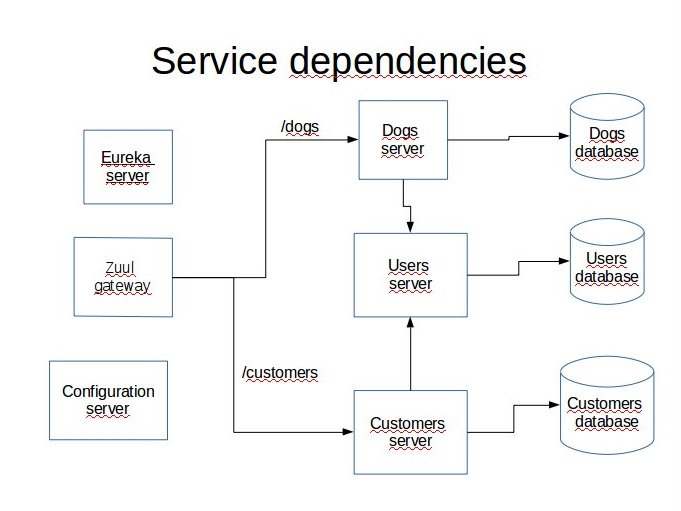
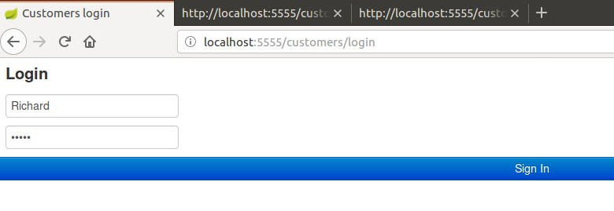
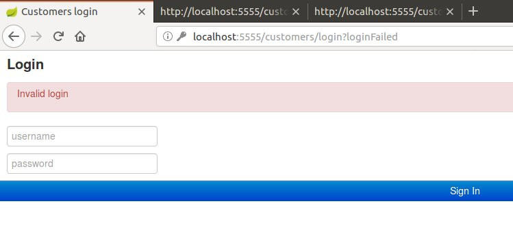
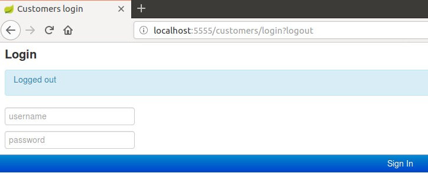
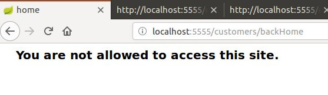

# garnet-gateway
I present here a microservice-oriented application demo that uses Spring Session with Redis implementation. It also uses Zuul as a gateway. It features two web page servers each with its own login running behind a Zuul reverse proxy. 

Here are the prerequisites for running the complete application:

Any Linux platform (I use Ubuntu 16.04)

MySQL server installed

A recent Redis version installed (I used 3.0.6)

A recent Apache Maven version installed (I used 3.3.9)

In addition I used Spring Tool Suite for developing this demo but it is not required for running the application.

The complete application is comprised of 2 user interfaces with different access rights and a single gateway. The two UI and the gateway share the same Redis backed Spring Session that uses default port 6379. 

The UI are customers-frontend on port 8080 and dogs-frontend on port 8081. The gateway itself runs on port 5555.

A separate Eureka server is used to register both services customers-service and dogs-services. 

A separate Spring Cloud configuration server sets all deployment properties for the two UI and the gateway that all have spring-cloud-config-client dependency. It fetches properties from the local file system. All configuration YAML files are stored in the subdirectory garnet-config-repo.

The dependencies are summarized on this figure:



Here are the steps to run the application.

## 1. Database creation

In MySQL client run the commands:
```
SOURCE garnetCustomers.sql
SOURCE garnetDogs.sql
SOURCE garnetUsers.sql
```

This creates three databases named garnet\_customers, garnet\_dogs and garnet\_users.

## 2. JAR files creation

In each project directory:
1. config-server
1. eureka-service
1. customers-server
1. dogs-server
1. users_server
1. garnet-gateway

run the Maven command:
```
./mvnw clean package
```

## 3. Launching the application

In each project directory (following the sequence)
1. config-server
1. eureka-service
1. customers-server
1. dogs-server
1. users-server
1. garnet-gateway

run the Maven command:
```
./mvnw spring-boot:run
```

Now you can access the site on port 5555. You can log separately on pages localhost:5555/customers and localhost:5555/dogs. For the sake of simplicity I have created 6 different in-memory users with different roles:

User      | Password | Roles
--------- | -------- | ----------------------------------------
Carol     | sator    | CUSTOMER_USER
Alice     | arepo    | CUSTOMER_USER, CREATE, UPDATE
Richard   | rotas    | CUSTOMER_USER, CREATE, UPDATE, DELETE
Marissa   | wombat   | DOG_USER
Steve     | apple    | DOG_USER, CREATE, UPDATE
Bill      | orange   | DOG_USER, CREATE, UPDATE, DELETE

Of course to execute a CRUD request you need to be granted the required authority. For example to be allowed to create a new customer you have to login as Alice or Richard etc. Moreover only Carol, Alice and Richard can access /customers and only Marissa, Steve and Bill can access /dogs.

Note that the only port exposed to the user is 5555. All requests including login are handled behin this port.

Here are some snapshots that illustrate the UI:

Customers login:


Customers failed login:


Customers logout:


Customers wrong role:



You can check the Redis backed Spring Session by connecting to Redis:

```
$ redis-cli
127.0.0.1:6379> keys *
1) "spring:session:sessions:expires:9de09f95-a036-4ee1-8173-2e4d245cdf79"
2) "spring:session:sessions:9de09f95-a036-4ee1-8173-2e4d245cdf79"
3) "spring:session:expirations:1521575940000"
4) "spring:session:index:org.springframework.session.FindByIndexNameSessionRepository.PRINCIPAL_NAME_INDEX_NAME:Richard"
127.0.0.1:6379> 
```

If the user logs out the session is invalidated but the Redis keys remain. You can delete them separately by connecting to Redis and running this command:

```
$ redis-cli
127.0.0.1:6379> FLUSHALL

```


